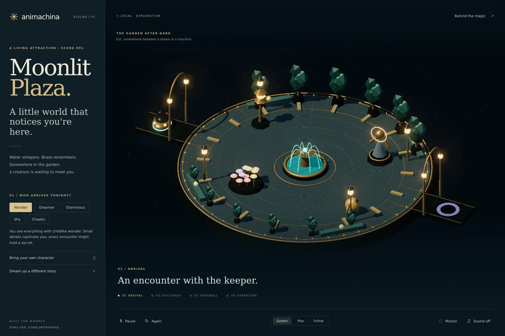

# Animachina

**Adaptive performance engine for living attractions.**

Animachina is an experiment in adaptive dark rides where scenes, characters and ride vehicles perform together in real time.

The engine is built around one boundary:

> **Content declares what performers can do. The policy decides what they do now.**

## Core loop

```text
Creative intent
      ↓
     Beat
      ↓
 World state
      ↓
derive opportunities from geometry + capabilities
      ↓
 DecisionPolicy   ← Jev
      ↓
intention + performance parameters
      ↓
deterministic movement / animation / show control
      ↓
 performers react
      ↓
 new world state
      ↺
```

## The anti-hardcoding rule

Animachina must not contain rules such as:

```text
glamorous → fountain
shy       → flowers
chaotic   → creature
```

A personality profile is **semantic context only**.

The engine knows physical truths:

- where the fountain is,
- what the vehicle can physically do,
- that the statue can turn, pose, or turn away,
- that the flowers can bloom, fold, or ripple,
- how to execute movement and animation safely.

It does **not** know which of those things a glamorous, shy, angry, curious, frightened, tired or completely new personality should prefer.

That judgment belongs to the policy.

## Core concepts

- **Scene** — bounded attraction space with creative intent, geometry and performers.
- **Beat** — dramatic intent plus broad action types and a completion condition. It is not a branch table.
- **Vehicle** — a physical performer with generic movement capabilities.
- **Actor** — a performer that declares its own finite capability vocabulary.
- **Opportunity** — derived at runtime from the current beat, spatial state and available performers.
- **Performance parameters** — speed, curvature, hesitation, dwell, facing, intensity, duration and similar continuous controls.
- **WorldState** — current scene truth plus recent events.
- **DecisionPolicy** — the pre-cortex seam.

## Performer grammar

Authoring answers:

> What can this thing physically do?

For example:

```text
fountain → pulse | burst | dim
statue   → turn-toward | turn-away | pose
flowers  → bloom | fold | ripple
creature → hop | hide | circle
```

The policy answers:

> Given who the guest is, what just happened, the active dramatic intent and the available capabilities, what makes sense now?

Animachina then executes the chosen capability deterministically.

## Moonlit Plaza demo

The first scene is **Moonlit Plaza**:

- a crafted mechanical garden in Three.js with isometric, overhead and follow cameras
- one vehicle
- fountain, statue, flowers, a clockwork creature and a living lantern
- five semantic profiles: Wonder, Dreamer, Glamorous, Shy and Chaotic, plus free-form visitors
- four beats: arrival, discovery, farewell and departure

The arrival beat does **not** list authored routes to each actor. It only allows generic actions such as `approach`, `observe`, `orbit` and `linger`.

The runtime derives concrete opportunities from the current geometry.

### Why the local fallback behaves randomly

`LocalPolicy` is intentionally random and **personality-blind**.

That is a feature.

Before Jev is connected, selecting Glamorous must not magically produce glamorous behavior. If it does, the intelligence has leaked back into hardcoded engine rules.

The local policy exists only to exercise:

- dynamic opportunity generation,
- parameterized vehicle performance,
- actor capability selection,
- scene state transitions.

## Jev integration

Jev is now wired through `src/engine/jev-policy.ts`.

The browser never sees the TypeSafe API key. During local development, `vite.config.ts` exposes a same-origin `/api/system-one` proxy and forwards requests to TypeSafe from the Node side.

Create `.env.local`:

```bash
TYPESAFE_API_KEY=your_key_here
```

The integration deliberately uses **two-stage decisions**.

### Vehicle

**Call 1: what happens?**

Jev receives the personality, creative intent, active beat, current world state, recent events and the dynamically-derived opportunities. A Choice question selects one real opportunity.

**Call 2: how is it performed?**

The chosen opportunity is added to state. Independent Score / Choice questions judge speed, path curvature, curve side, hesitation, dwell and facing.

### Actor

**Call 1: what reaction?**

Jev chooses one capability the actor physically owns.

**Call 2: how is it performed?**

With that capability fixed, Jev judges intensity, duration and anticipation delay.

This follows the System One design rule: keep judgments atomic, then compose them in code.

### Probability is part of the performance

Animachina does **not** treat Jev's `choice` field as a script command.

A Choice answer also contains a probability distribution. The runtime samples that distribution with a small amount of generic exploration, so the semantic judgment remains the center of gravity without collapsing every identical starting state into the same ride.

The director applies only generic pacing rules:

- recently used opportunities are softly down-weighted, never forbidden;
- recently used actor capabilities are softly down-weighted;
- no personality name has a special-case rule;
- Score distributions are sampled around Jev's expected score, producing small variations in speed, curvature, hesitation, dwell, intensity and timing.

So a Glamorous profile may strongly prefer the fountain, but it is a **tendency**, not a route table.

The browser console logs Jev's argmax, the actually sampled choice, and the returned probability distribution for each vehicle and actor decision.

If Jev is unavailable or the key is missing, the demo falls back to `LocalPolicy`. The debug overlay exposes the source, so a `local` decision cannot masquerade as Jev.

Jev still does not invent geometry or bypass physical capabilities.

In short:

> **Jev judges what makes sense. Animachina performs what is possible.**

## Adaptive show control

The stage policy adds a second decision boundary after the actor selects its behavior:

```text
vehicle decision
      ↓
vehicle performs
      ↓
actor decision
      ↓
actor selects performance
      ↓
StageDirector  ← Jev
   ╱   │   ╲
actor + light + sound + set perform together
      ↓
show cues feed back into recentEvents
```

The StageDirector does not invent a new plot event. It receives the actor moment that already exists and answers a narrower Imagineering-style question:

> How should the attraction support this moment?

### LightRig

The Moonlit Plaza currently declares:

- `focus-actor`
- `follow-vehicle`
- `dim-world`
- `warm-world`
- `cool-world`
- `pulse-world`
- `hold-light`

These are physical show-control capabilities. Jev selects among them and judges the overall stage energy, anticipation and sustain.

### SoundRig

The prototype uses WebAudio so the show-control architecture can be tested without audio assets:

- `chime`
- `shimmer`
- `low-hit`
- `rustle`
- `swell`
- `chirp`
- `silence`

Sound requires a browser user gesture. Use the **Sound** button in the demo to unlock WebAudio.

Production audio can later replace these procedural cues with authored stems, spatial samples and music systems without changing the StageDirector contract.

### Scenic motion

The plaza now has simple scenic machinery around its perimeter. The authored capability vocabulary is:

- `ring-turn`
- `counter-turn`
- `wings-open`
- `wings-sway`
- `plaza-breathe`
- `hold-set`

Again, no personality maps to any cue. The machinery only knows what it can physically perform.

### Temporal envelope

Each Jev stage decision also judges:

- overall energy,
- anticipation before the cue,
- sustain time.

Animachina turns that into a shared attack / sustain / release envelope, so light and scenic motion feel like one coordinated show response instead of unrelated effects.

The selected light, sound and scenic-motion cues are written back into `recentEvents`. Later vehicle and actor judgments therefore know what the attraction itself just did.

## Rendering boundary

The runtime is renderer-independent and uses X/Z scene space. The renderer now offers an isometric miniature, a plan view and a follow camera. Future stagecraft can replace:

- orthographic → perspective camera,
- primitives → authored sets and characters,
- simple steering → ride hardware / animation systems.

The policy and world contracts should survive.

## Run

```bash
npm install
npm run dev
```

## Status

v0.5: a mechanical moon garden, readable four-beat performances, clearance-aware motion, synchronized actor/stage moments, custom visitors, and optional DiffusionGemma creative direction.



### Experience controls

- **Garden / Plan / Follow**: smoothly switch between the miniature, spatial overview and vehicle-focused camera.
- **Pause / Again**: pause simulation and enabled audio, or start a fresh performance with the current visitor and story.
- **Motion / Calm**: reduce ambient movement and camera transitions; system reduced-motion preferences are respected on load.
- **Sound**: explicit audio unlock and on/off control. Reset stops voices from the previous performance.
- **Behind the magic**: inspect vehicle, actor and stage decisions, confidence and provider source.
- **Bring your own character**: submit a semantic description. No new personality-specific rules are added.

### Optional DiffusionGemma direction

Add `NVIDIA_API_KEY` to `.env.local`, restart Vite, then use **Dream up a different story**.
The server calls NVIDIA NIM's `google/diffusiongemma-26b-a4b-it` at `https://integrate.api.nvidia.com/v1/chat/completions`.
The adapter follows [NVIDIA's published endpoint example](https://build.nvidia.com/google/diffusiongemma-26b-a4b-it).

DiffusionGemma composes a title, creative intent and the four beat intentions. The response is validated and reduced to those fields. It cannot change geometry, introduce capabilities, alter the beat graph or execute code. Jev still chooses the actual moment-to-moment performances. A failed or unconfigured creative call leaves the current scene intact and reports the problem; no generated story is fabricated locally.

Both API keys stay server-side. These endpoints are provided by the Vite development/preview server; a static `dist` host needs equivalent server routes. Creative requests are bounded to 22 seconds upstream, while Jev requests are bounded to 3.2 seconds upstream / 3.5 seconds in the browser.

### Timing and navigation

The runtime holds the vehicle while the actor and supporting stage decisions are prepared. The actor and stage then start together, retaining their authored anticipation, and the dwell covers the longer performance envelope. State is snapshotted before asynchronous policy calls; reset generations prevent stale decisions entering a new ride.

Routes are derived from circular performer clearance footprints using a visibility graph, with rounded corners and expressive arcs admitted only when collision-free. Ease-in/ease-out travel and smoothed facing replace constant-speed steering. This is a simulated navigation model, not a hardware safety controller; decorative scenery is not included in the obstacle graph.

### Validation

Run `npm ci`, `npm test`, and `npm run build`. Tests cover performer clearance across action/position/curvature combinations, waiting for delayed actor/stage responses, a complete four-beat ride, resets during in-flight work, stage response ordering and creative-output validation.

The UI was smoke-tested in Chromium at desktop and mobile sizes, including profile changes, pause/resume, camera controls, inspector controls missing-key behavior, audio toggling, the two-stage Jev request contract and applying a creative story with simulated provider responses. Live Jev/NIM output quality and remote latency still need verification with configured credentials.

The experiment now has a falsifiable test:

> Run the same authored scene with different semantic personality descriptions. Distinct behavior should emerge from Jev decisions, **without adding personality-specific engine rules**.

Next: observe whether the **same behavioral moment** receives meaningfully different but coherent stage treatment across personalities and runs, then replace prototype show assets with richer authored rigs only after the direction layer proves itself.

